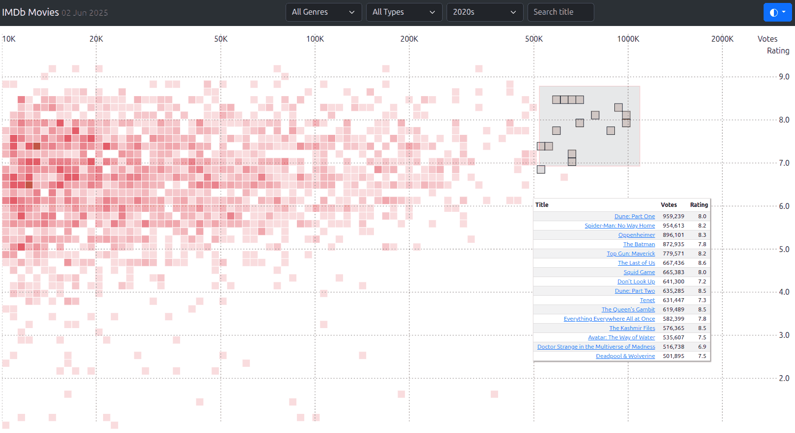

# IMDb Movie Explorer

An interactive visualization tool for exploring IMDb movies and TV series data. View over 30,000 titles plotted by rating vs. popularity, with powerful filtering capabilities.

🔗 **Live Demo**: [https://sanand0.github.io/imdb/](https://sanand0.github.io/imdb/)



## Features

- **Interactive Heatmap**: See all movies at a glance - higher rated films appear toward the top, more popular (heavily voted) films toward the right. Each colored cell represents movies clustered at that rating/popularity intersection.
- **Smart Filtering**: Use the dropdown menus to narrow your search - select a specific genre like "Horror" or "Comedy", choose movies vs. TV series, pick a decade like "1990s", or search for titles containing specific words.
- **Brush Selection**: Click and drag to select any rectangular area on the chart. This will show you all movies within that rating and popularity range, perfect for finding films that match your exact preferences.
- **Hover Details**: Simply move your mouse over any colored cell to instantly see a list of movies at that spot, complete with their exact ratings and vote counts.
- **Dark/Light Theme**: Click the theme toggle in the top-right corner to switch between light and dark modes for comfortable viewing in any lighting condition.
- **Direct IMDb Links**: Click any movie title in the results to open its full IMDb page in a new tab, where you can read plot summaries, cast information, and user reviews.

## For Movie Enthusiasts

This tool helps you discover movies in several ways:

- **Find Hidden Gems**: Look for highly-rated movies with fewer votes (upper-left quadrant)
- **Discover Popular Favorites**: Explore the most-voted movies across different rating ranges
- **Genre Deep-Dives**: Filter by specific genres like "Sci-Fi" or "Documentary" to find niche content
- **Era Exploration**: Browse movies by decade to discover classics or recent releases
- **Quality vs. Popularity Analysis**: See how critical acclaim correlates with audience size
- **Comparative Research**: Use brush selection to compare movies within specific rating/popularity ranges

## Setup & Local Development

### Prerequisites

- Python 3.11 or higher
- Modern web browser

### Quick Start

1. **Clone the repository**:

   ```bash
   git clone https://github.com/sanand0/imdb.git
   cd imdb
   ```

2. **Download and process IMDb data**:

   ```bash
   python imdb_refresh.py
   ```

   This downloads the latest IMDb datasets (~200MB) and generates `movies.csv` with filtered data.

3. **Serve locally**:
   ```bash
   python -m http.server 8000
   ```
4. **Open in browser**:
   Navigate to `http://localhost:8000`

### Data Updates

The IMDb datasets are updated daily. To refresh your local data:

```bash
python imdb_refresh.py
```

## How It Works

1. **Data Processing**: `imdb_refresh.py` downloads IMDb's title.basics and title.ratings datasets, filters for movies/series with 10K+ votes, and exports to CSV
2. **Visualization**: D3.js creates an interactive grid where each cell represents movies at specific rating/vote coordinates
3. **Filtering**: Client-side filtering allows real-time exploration without server requests
4. **Interactivity**: Mouse events and brush selection provide detailed views of the data

## Data Source

Data sourced from [IMDb Non-Commercial Datasets](https://datasets.imdbws.com/), updated daily. The visualization includes:

- Movies and TV series with 10,000+ votes
- Ratings from 1-10
- Vote counts from 10K to 3M+
- Release years from 1930s to 2020s

## License

[MIT](LICENSE)
